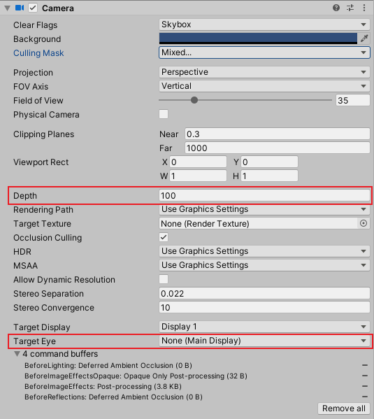

# How To Setup Multiple Cameras In VRChat
__GOAL__: Multiple switchable 3rd-person camera angles in a VRChat world that can be recorded through OBS

## Instructions
https://ask.vrchat.com/t/feeding-udon-controlled-camera-view-to-stream-camera/8244 (Thank you to [CorporateTool](https://twitter.com/CorporateT00l) from AniCLover for the research!)

* Add extra cameras (Cinemachine works if you use the Camera component on the same GameObject as CinemachineBrain)
* On the Camera components, set `Depth = 100`
* Set `Target Eye = None`
* Create an Udon behaviour to enable/disable cameras based on keyboard input/UI buttons/whatever you like

When one of these cameras is enabled, it will take priority over the default POV camera and render it's output to the VRChat window. The Player's VR view won't be affected. 

__Ensure you set `Target Eye = None`__ unless you want to give VR players an instant headache!

## How To Hide UI Elements from Extra Cameras
__TL;DR:__ Disable UI layers from Camera's CullingMask

* http://vrchat.wikidot.com/worlds:layers

The CullingMask option on the Camera component controls what is rendered in the camera view.  Disabling the `Ui` and `UiMenu` layers will hide most of VRChat's menues from the Camera. `PlayerLocal` renders the player from their POV, we disable this to prevent double-rendering the player.

![[vrchat_camera_cullingmask.png]]

If you have mirrors in your VRChat world, you should ensure they don't render the UI either, otherwise your cameras will see the UI reflected in the mirror.

## VRChat Camera Prefabs
### VRChat Udon Cinemachine
* https://booth.pm/ja/items/3092308

RollTheRed has created a prefab which implements the above setup already, includes switching functionality and animated cameras out of the box. Requires [CyanTrigger](https://cyanlaser.booth.pm/items/3194594)

### Virtual TV Studio
[Tsuboku Lab](https://twitter.com/kohack_v) have a similar implementation in a VRchat world already, [Virtual TV Studio](https://vrchat.com/home/world/wrld_876856a1-1dc4-4a52-b540-6803a9a3c1e6)
At the time of writing, the Video mixer component doesn't seem to be released publically.

