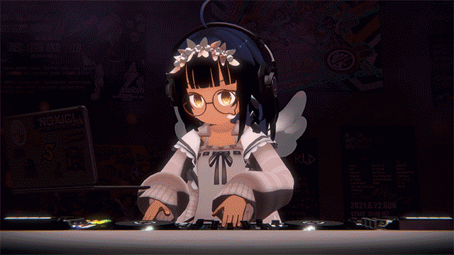

# Laser Imouto's VRDJ Notes
This is my collection of notes, links and (hopefully) helpful guides I've collected in the course of working on my Virtual Reality DJing (VRDJ) setups.

[Example of my VRDJ setup (via Youtube)](https://www.youtube.com/watch?v=3dWBrlHmowc)

These notes focus on DJing using Unity or on VRChat, and assumes a workable knowledge of Unity and VR technologies.

If you're brand new to VRDJing, I highly recommend DJ Sharpnel's [NARERU! Virtual DJ (Virtual DJ Startup Guide)](https://booth.pm/ja/items/2766074), available in both English and [Japanese](https://booth.pm/ja/items/1574890). It provides a great introduction to VRDJing, as well as practical guides to go from starting out to actually performing. This book has saved me countless hours, and contains lots of great knowledge from one of the pioneers of VRDJing.

## Unity VRDJ
Links for Unity-related guides:
* [Unity VRDJ Overview](/Unity VRDJ Overview.md)
* [EasyVirtualMotionCaptureForUnity (EVMC4U)](/EVMC4U.md)

## VRChat VRDJ
Links for VRChat-related guides:
* [How To Setup Multiple Cameras In VRChat](/How To Setup Multiple Cameras In VRChat.md)
* [Streaming Video for VRChat](/Streaming Video for VRChat.md)

### Useful External Resources
* [VRCLibrary](https://vrclibrary.com/wiki/) - Wiki with useful information of VRChat world-building and avatar-creation
* [Getting Started With Udon](https://docs.vrchat.com/docs/getting-started-with-udon) - VRChat's own Udon documentation
* [LTCGI](https://github.com/PiMaker/ltcgi) - Optimized, realtime area lighting for VRChat
