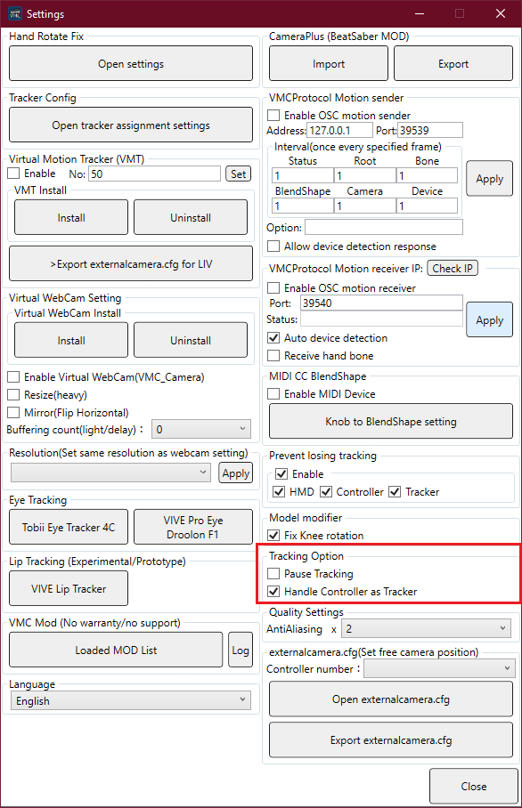
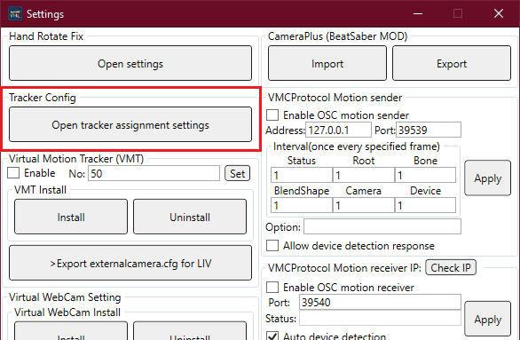
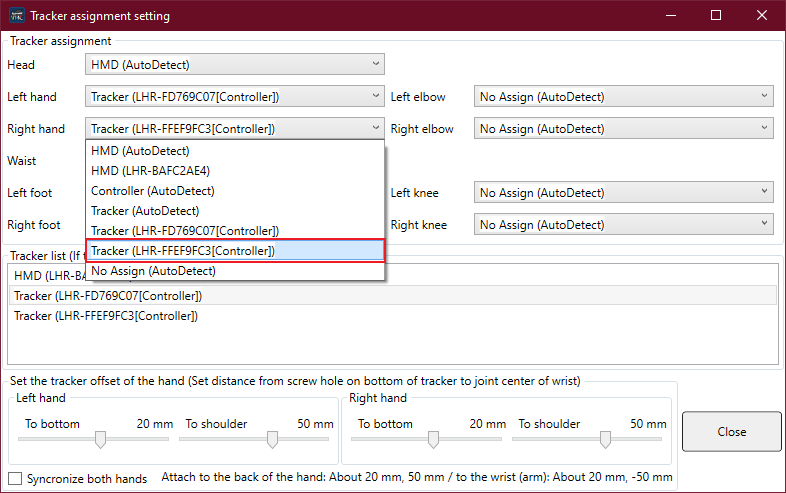

# Using Vive Controllers as Trackers in VMC
Vive wands are too chunky to hold in your hand and also operate DJ gear, so you'll probably want to strap them to your wrists instead.

However, Vive wands expect to be held in your hands, so if you attach them to your wrists the rotation and position will be wrong (even if you try to account for this while calibrating). Instead, you should set the controllers to behave as trackers:

1. Open Settings
2. Enable "Handle Controller as Tracker"

3. Choose "Open tracker assignment settings"

4. Set the Left+Right hands to Tracker(Controller). You can move the controller to highlight the matching menu item green.

5. Calibrate (switching modes will have messed up any previous calibration)

### Disclaimer
Hand/arm/wrist positioning is still a bit wonky using this method, but it's much better than before. 

Vive wands are also kind of difficult to attach to your wrists ;(